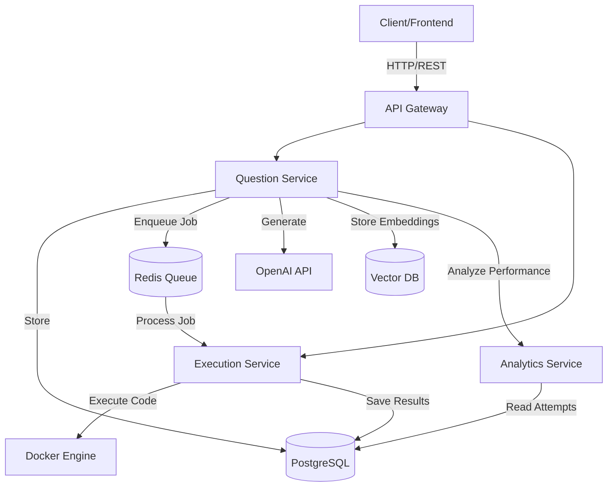
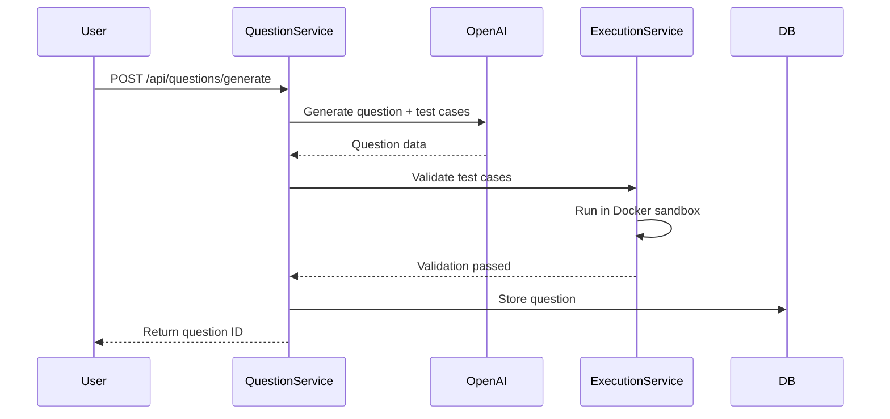

# System Architecture

## High-Level Overview


## Question Generation Flow


```
sequenceDiagram
    participant User
    participant QuestionService
    participant OpenAI
    participant ExecutionService
    participant Database
    
    User->>QuestionService: POST /generate
    QuestionService->>OpenAI: Generate question
    OpenAI-->>QuestionService: Question + test cases
    QuestionService->>ExecutionService: Validate test cases
    ExecutionService->>ExecutionService: Run in Docker
    ExecutionService-->>QuestionService: Validation result
    QuestionService->>Database: Store question
    QuestionService-->>User: Return question
```

---

### 3. **Database Schema / ER Diagram**
Visual representation of your tables and relationships.

**What to include:**
- All tables with columns
- Primary keys (PK)
- Foreign keys (FK)
- Relationships (one-to-many, many-to-many)
- Indexes

**Your core schema:**
```
┌─────────────────┐         ┌──────────────────┐
│   users         │         │   questions      │
├─────────────────┤         ├──────────────────┤
│ PK id           │         │ PK id            │
│    email        │         │    type          │
│    created_at   │         │    difficulty    │
└─────────────────┘         │    track         │
        │                   │    content       │
        │                   │    test_cases    │
        │                   │    source        │
        │                   └──────────────────┘
        │                            │
        │                            │
        │         ┌──────────────────┴──────────┐
        │         │                             │
        ↓         ↓                             ↓
┌─────────────────────────┐         ┌──────────────────────┐
│   user_attempts         │         │ question_embeddings  │
├─────────────────────────┤         ├──────────────────────┤
│ PK id                   │         │ FK question_id       │
│ FK user_id              │         │    embedding         │
│ FK question_id          │         │    concept_tags[]    │
│    submitted_code       │         └──────────────────────┘
│    result               │
│    correct              │
│    attempted_at         │
└─────────────────────────┘

┌─────────────────────────┐
│   knowledge_graph       │
├─────────────────────────┤
│ PK id                   │
│ FK user_id              │
│    concept              │
│    mastery_score        │
│    last_updated         │
└─────────────────────────┘
```

**Best tools:**
- **dbdiagram.io** (https://dbdiagram.io) - BEST for database schemas, code-based, free
- **DrawSQL** (https://drawsql.app) - Visual editor, clean output
- **pgAdmin** - If you're already using PostgreSQL

**My recommendation**: **dbdiagram.io** - you write the schema in a DSL and it generates beautiful diagrams.

**Example dbdiagram.io syntax:**
```
Table questions {
  id uuid [pk]
  type varchar(20)
  difficulty varchar(20)
  track varchar(50)
  content jsonb
  test_cases jsonb
  created_at timestamp
}

Table user_attempts {
  id uuid [pk]
  user_id uuid [ref: > users.id]
  question_id uuid [ref: > questions.id]
  submitted_code text
  result jsonb
  correct boolean
  attempted_at timestamp
}
```

---

### 4. **API Documentation Diagram** (Optional but Impressive)
Visual representation of your REST endpoints.

**What to include:**
- All endpoints grouped by service
- HTTP methods (GET, POST, PUT, DELETE)
- Request/response schemas
- Authentication requirements

**Tools:**
- **Swagger/OpenAPI** (https://editor.swagger.io) - Industry standard, auto-generates from FastAPI
- **Postman** - API testing + documentation

**My recommendation**: FastAPI auto-generates this for you at `/docs` - just make sure your docstrings are good!

---

### 5. **Deployment Architecture** (For Later)
Shows how services are deployed (Docker, Kubernetes, cloud services).

**Example:**
```
[AWS/GCP/Azure]
    │
    ├─ Load Balancer
    │   └─ API Gateway (Container)
    │
    ├─ Service Cluster
    │   ├─ Question Service (3 replicas)
    │   ├─ Execution Service (5 replicas)
    │   └─ Analytics Service (2 replicas)
    │
    ├─ Database Cluster
    │   ├─ PostgreSQL (Primary)
    │   └─ PostgreSQL (Replica)
    │
    └─ Cache Layer
        └─ Redis Cluster